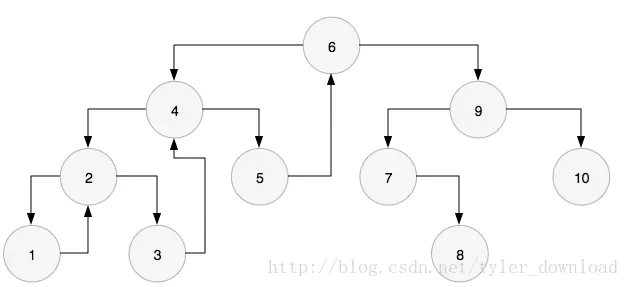

# Leetcode In Golang

使用golang刷leetcode算法题，总结题型以及展示解法

### 🎄Tree

树的类型的题目算是比较简单的一类，也是推荐先从这一块上手。

一般来说，这类型的题目就是对树的遍历算法进行一些变式，只要掌握了树的前序遍历、中序遍历、后序遍历以及层次遍历就可以很轻松的上手刷题，廉价满足感飙升！

#### 基本原理

- **前序遍历**： 遍历节点的顺序是 *根节点 -> 左孩子 -> 右孩子*
- **中序遍历**： 遍历节点的顺序是 *左孩子 -> 根节点 -> 右孩子*
- **后序遍历**： 遍历节点的顺序是  *左孩子 -> 右孩子-> 根节点*


##### 递归版本（前序遍历、中序遍历、后序遍历）

递归版本是非常简单的：

- 在遍历左孩子和右孩子之前，在当前节点进行操作，就是前序遍历
- 在遍历左孩子之后和右孩子之前进行操作，就是中序遍历
- 在遍历左孩子和右孩子之后进行操作，就是后序遍历

```go
/**
 * Definition for a binary tree node.
 * type TreeNode struct {
 *     Val int
 *     Left *TreeNode
 *     Right *TreeNode
 * }
 */

func Traverse (root *TreeNode) {
 	var dfs func(*TreeNode)

 	dfs=func(root *TreeNode){
 		if root==nil{
 			return
 		}
        // Do something   : 前序遍历
        dfs(root.Left)
        // Do something   : 中序遍历
 		dfs(root.Right)
        // Do something   : 后序遍历
 	}

 	dfs(root)
}
```

##### 非递归版本

[非递归版本](https://www.cnblogs.com/fanguangdexiaoyuer/p/10493104.html)主要借助于栈来实现，通过变化流程，来达到不同顺序的遍历。但是golang本身并不提供栈的实现，我们可以使用slice来实现一样的效果。

<details>
<summary><strong>前序遍历</strong></summary>

依据前序遍历的顺序，优先访问根结点，然后访问左子树和右子树。所以，对于随意结点node，即可以直接訪问之，之后在推断左子树是否为空，不为空时就反复上面的步骤，直到其为空。若为空。则需要访问右子树。我们可以使用栈来模拟这个过程。对于任意一个结点node，详细过程例如以下：

1. 访问当前节点，并把结点node入栈。当前结点置为左孩子；

2. 判断结点node是否为空，若为空。则取出栈顶结点并出栈，将右孩子置为当前结点；否则重复步骤1直到当前结点为空或者栈为空（栈中的结点就是为了能够后续访问到右孩子才存储的）

```go
func Traversal(root *TreeNode) {

	stack:=make([]*TreeNode,0)

	for root!=nil || len(stack)!=0{
		if root!=nil{
            // Do something to root : 前序遍历
            stack=append(stack,root)       // push: 入栈
			root=root.Left
		}else{
            root = stack[len(stack)-1]     // pop: 出栈
			stack = stack[:len(stack)-1]
			root=root.Right
		}
	}
}
```

</details>

**中序遍历**

中序遍历非常类似于谦虚遍历，只是变换一下进行操作的位置

```go
func Traversal(root *TreeNode) {
    
	stack:=make([]*TreeNode,0)

	for root!=nil || len(stack)!=0{
		if root!=nil{
            stack=append(stack,root)       // push: 入栈
			root=root.Left
		}else{
            root = stack[len(stack)-1]     // pop: 出栈
            stack = stack[:len(stack)-1]
            // Do something to root : 中序遍历
			root=root.Right
		}
	}
}
```


另外一种实现

```go
func Traversal(root *TreeNode){
    stack:=[]*TreeNode{}
    
    for len(stack)!=0 || root!=nil{
        for root!=nil{
            stack = append(stack,root)
            root = root.Left
        }
        root = stack[len(stack)-1]
        stack = stack[:len(stack)-1]
        
        //Do something to root : 中序遍历
        
        root = root.Right
    }
}
```


**后序遍历**

后续遍历的非递归版本因为需要保证在访问左孩子和右孩子之后才访问当前节点，流程控制上稍微麻烦一点，大致有三种实现方式：

1.  第一种思路：对于任一结点P，将其入栈，然后沿其左子树一直往下搜索。直到搜索到没有左孩子的结点，此时该结点出如今栈顶，可是此时不能将其出栈并访问，因为其右孩子还未被访问。所以接下来依照同样的规则对其右子树进行同样的处理，当访问完其右孩子时。该结点又出如今栈顶，此时能够将其出栈并访问。这样就保证了正确的访问顺序。能够看出，在这个过程中，每一个结点都两次出如今栈顶，仅仅有在第二次出如今栈顶时，才去访问它。因此须要多设置一个变量标识该结点是否是第一次出如今栈顶。

```go
func Traversal(root *TreeNode){
    type BTNode struct{
        btnode *TreeNode
        isFirst bool
    }
    
    var temp *BTNode
    var pre *TreeNode = root
    stack:=make([]*BTNode,0)
 
    for pre!=nil || len(stack)!=0{
        for pre!=nil{
            btn:=make([]*BTNode,1)
            btn.btnode = pre
            btn.isFirst = true
            stack = append(stack, btn)
            pre = pre.Left
        }
        

        temp = stack[len(stack)-1]
        stack = stack[:len(stack)-1]
        if temp.isFirst {
            temp.isFirst = false
            stack = append(stack, temp)
            p = temp.btnode.Right
        }else{
            // Do something  : 后序遍历
            pre = nil
        }
    }
}
```

2. 第二种思路： 要保证根结点在左孩子和右孩子被访问之后才能被访问，因此对于任一结点P。先将其入栈。假设P不存在左孩子和右孩子。则能够直接访问它；或者P存在左孩子或者右孩子。可是其左孩子和右孩子都已被访问过了。则相同能够直接访问该结点。若非上述两种情况。则将P的右孩子和左孩子依次入栈。这样就保证了每次取栈顶元素的时候，左孩子在右孩子前面被访问。左孩子和右孩子都在根结点前面被访问。

```go
func Traversal(root *TreeNode){
    stack:=make([]*TreeNode,0)
 	var cur *TreeNode
    var pre *TreeNode
    stack = append(stack,root)
    for len(stack)!=0{
        cur = stack[len(stack)-1]
        if (cur.Left == nil && cur.Right == nil) || (pre!=nil && (pre == cur.Left || pre == cur.Right)){
            // Do something
            stack = stack[:len(stcak)-1]
            pre = cur
        }else{
            if cur.Right!=nil{
                stack = append(stack,cur.Right)
            }
            if cur.Left!=nil{
                stack = append(stack, cur.Left)
            }
        }
    }
}
```

3. 第三种思路： 前序遍历的非递归版本，访问顺序依次是根节点->左子树->右子树，如果将压栈顺序改动一下，可以很容易得到根节点->右子树->左子树，观察这个顺序和后序遍历左子树->右子树->根节点正好反序。

```go
func Traversal(root *TreeNode){
    if root == nil{
        return
    }
    var temp *TreeNode = root
    stack:=make([]*TreeNode,0)
    list:=make([]*TreeNode,0)
    
    for len(stack)!=0 || temp!=nil{
        if temp1=nil{
            stack = append(stack,temp)
            list = append(list,temp)
            temp = temp.Right
        }else{
            node:=stack[len(stack)-1]
            stack = stack[l:len(stack)-1]
            temp = node.Left
        }
    }
    
    for i:=len(list)-1 ;i>=0;i--{
        // Do something to list[i]  : 后序遍历
    }
}
```

至此，我们就展示了后续遍历的三种实现思路，可以根据自己的喜好来进行选择。

**层次遍历**

层次遍历的代码比較简单。仅仅须要一个队列就可以。先在队列中增加根结点。之后对于随意一个结点来说。在其出队列的时候，訪问之。同一时候假设左孩子和右孩子有不为空的。入队列。代码例如以下：

```go
func Traversal(root *TreeNode){
    if root==nil{
        return
    }
    
    queue:=make([]*TreeNode,0)
    queue=append(queue,root)
    
    for len(queue)!=0{
        temp:=queue[0]
        queue = queue[1:]
        // Do something to temp  :层次遍历
        if temp.Left!=nil{
            queue = append(queue,temp.Left)
        }
        if temp.Right!=nil{
            que = append(que,temp.Right)
        }
    }

}
```

**Morris遍历算法**

先直接给出JAVA实现

```java

public class MorrisTraval {
    private TreeNode root = null;
    public MorrisTraval(TreeNode r) {
        this.root = r;
    }
    
    public void travel() {
        TreeNode n = this.root;
        
        while (n != null) {
            if (n.left == null) {
                System.out.print(n.vaule + " ");
                n = n.right;
            } else {
                TreeNode pre = getPredecessor(n);
                
                if (pre.right == null) {
                    pre.right = n;
                    n = n.left;
                }else if (pre.right == n) {
                    pre.right = null;
                    System.out.print(n.vaule + " ");
                    n = n.right;
                }
                
            }
        }
    }
    
    private TreeNode getPredecessor(TreeNode n) {
        TreeNode pre = n;
        if (n.left != null) {
            pre = pre.left;
            while (pre.right != null && pre.right != n) {
                pre = pre.right;
            }
        }
        
        return pre;
    }
    
}

```

辅以例子：


- 对二叉搜索树的中序遍历是一个升序的数列
- 我个人对算法的理解是：
  - 首先从根节点开始向左子树不断去寻找节点的前驱节点，并且将前驱节点的右孩子指向后继节点
  - 结果如下，从6开始，寻找到前驱节点5，5的前驱是4，4的前驱是3，以此类推一直到1，然后我们就可以从节点1出发，不断访问右孩子，输出1到6.
  - 
  - 对于右子树，我们可以将其看为一个完整的树，root指向9，那么重复上述过程，我们可以得到7到9的数列
  - 同理，对于10来说，也看做是一个单节点的树，输出10


